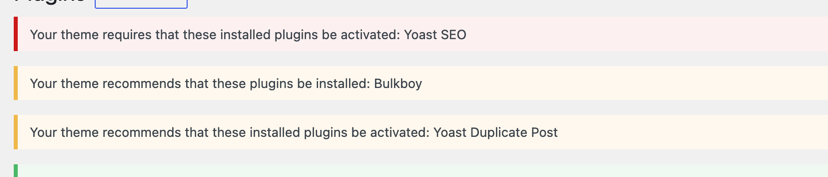
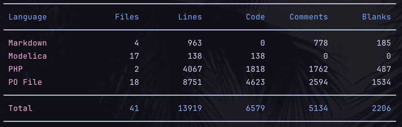

# Plugger

### WIP. Not ready for production.

This is a loose (human) rewrite
of [TGMPA](https://github.com/TGMPA/TGM-Plugin-Activation) which is intended to be
used as
a composer dependency rather than packaged with
WordPress
themes or plugins so it doesn't care about WordPress coding 'standards' or backwards compatibility with ancient themes.

TGMPA still works fine but hasn't been updated for 7 years and is one file with 3653 lines of spaghetti, so I'm
doing
this as much for the fun challenge of working through its code, using modern php where appropriate (like `Enums` and
`match`) and improving what I can as anything else. The current
goal is feature parity and once I reach that we can look at enhancements.

Obviously, managing plugins via composer is a completely rational way of doing this in this day and age but doesn't
always fit the
user or deployment model, so I think there's still a legitimate need for this kind of programme.

## Getting Started

```php
$plugins = [
    [
        'name' => 'Yoast SEO', //yuck
        'slug' => 'wordpress-seo',
        'required' => true,
        'force_activation' => true,
    ],
    [
        'name' => 'Yoast Duplicate Post',
        'slug' => 'duplicate-post',
        'required' => false,
    ],
    [
        'name' => 'Bulkboy', // if non WP repo define a source
        'slug' => 'bulkboy',
        'source' => 'https://github.com/danieldevine/bulkboy/archive/refs/tags/v1.0.0.zip',
        'required' => false,
    ],
];

$plugger = new Coderjerk\Plugger($plugins)
$plugger->init();
```



## Features

1. Define required and recommended plugins in theme
2. Display notifications to the user making them aware that they need to install/activate required plugins
3. Force activation of specified required plugins
4. Notify when updates are required
5. enhancement: blacklist plugins - prevent activation of blacklisted plugins deemed incompatible. Like Elementor for
   example.

## Notes

I strongly recommend using in conjunction with an object cache as the plugin makes http requests to the wordpress.org
and github APIs which will slow things down on the admin page depending on number of plugins if not cached. If an object
cache is active then the requests will be cached for 9000 seconds by default.(TODO make this configurable).

## Contributing

Human contributions in the form of PRs, issues and discussion are very welcome, obvious AI contributions to any of the
above will be ignored. It's just not interesting to me.

### Set up the test theme environment

```composer build-test-theme```
This will create a functional installation of the world's greatest WP theme for testing.If using Laravel
Valet you can immediately visit it by going to http://blart.test. This can be used for manual amd automated testing. The
theme and db are wiped and reinstalled on rerun of the command.

### Code Comparison

##### TGMPA



##### Plugger


